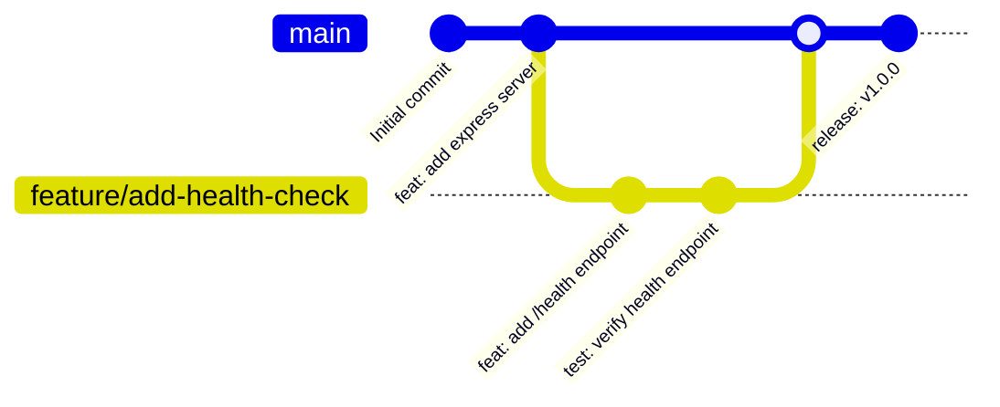

# DevOps Lab 1: Node.js Express CI/CD Pipeline

This repository contains a containerized Node.js + Express application with automated testing and Jenkins CI/CD pipeline integration.

---

## 🛠️ Tech Stack

*   **Runtime:** Node.js (Express framework)
*   **Testing:** Jest & Supertest
*   **Containerization:** Docker (Multi-stage builds)
*   **CI/CD Automation:** Jenkins Pipeline

---

## 📂 Project Structure

```text
devops-lab1-ci-cd/
├── src/
│   ├── app.js               # Application entry point
│   └── routes/
│       ├── index.js         # Main routes
│       └── health.js        # Health check endpoint
├── __tests__/
│   └── app.test.js          # Jest unit tests
├── Dockerfile               # Production Docker build definition
├── Jenkinsfile              # Jenkins declarative pipeline script
├── .gitignore               # Ignored files list
└── package.json             # App metadata & dependencies
```

---

## 🌿 2.3 Branch Strategy

We follow a simplified **GitHub Flow / Feature Branching** strategy:



### Branches Used:
1.  **`main`**: The default branch representing production-ready code. Only merged after tests pass.
2.  **`feature/*`** or **`fix/*`**: Temporary branches used for development. PRs (Pull Requests) are created to merge these branches back into `main`.

---

## 📝 2.4 Meaningful Commit Conventions

We strictly adhere to the **Conventional Commits** specification to maintain a clean git log:

### Commit Format:
```text
<type>(<scope>): <description>

[optional body]
```

### Commit Types:
*   `feat`: A new feature (e.g., `feat(routes): add health check route`).
*   `fix`: A bug fix (e.g., `fix(deps): add package-lock.json for npm ci`).
*   `docs`: Documentation changes only (e.g., `docs: update README with branch strategy`).
*   `style`: Code style changes (formatting, missing semi-colons, etc.; no production logic changes).
*   `test`: Adding or correcting tests (e.g., `test(api): add tests for about page`).
*   `chore`: Updating build tasks, package manager configs, etc. (e.g., `chore: update gitignore`).

---

## 🚀 How to Run Locally

### 1. Development Mode
```bash
npm install
npm run dev
```

### 2. Run Tests
```bash
npm test
```

### 3. Run with Docker
```bash
docker build -t devops-lab1-app .
docker run -p 3000:3000 --name devops-lab1-container devops-lab1-app
```
Check health at: `http://localhost:3000/health`
